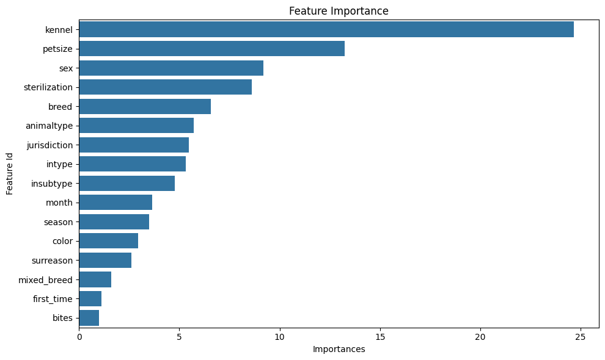

# 🐾 Predicting Risk in Shelter Animals
### Data Mining Course Project (2025)


> **Authors:** Kfir Diamond & Daniel Tugendhaft
> **Course:** Advanced Topics in ML / Data Mining

---

## 📖 Overview
Animal shelters operate under severe resource constraints. Making the right decision at the moment of intake can be the difference between life and death.

This project implements a full **Machine Learning Pipeline** to predict whether an incoming animal is at **High Risk** (Euthanasia, Death) or **Safe** (Adoption, Transfer). We utilize **LightGBM** for classification and **K-Modes** for unsupervised risk profiling.

### 🎯 Key Goals
* **Maximize Recall:** Prioritizing the identification of *all* at-risk animals to prevent false negatives.
* **Handle Imbalance:** Addressing the minority class challenge using cost-sensitive learning.
* **Interpretability:** Understanding *why* an animal is flagged as risky.

---

## 📊 Performance Highlights

Our model achieves a **Recall of ~75%**, effectively flagging 3 out of 4 high-risk animals immediately upon intake.

| Metric | Score | Significance |
| :--- | :--- | :--- |
| **Recall (Sensitivity)** | **0.75** | Crucial for safety - minimizes missed risk cases. |
| **ROC-AUC** | **0.85** | Indicates strong separation capability. |
| **Precision** | 0.34 | Accepted trade-off to ensure higher recall. |

### 🔍 Top Predictors
The model identified the following features as most critical for triage:
1.  **Kennel Location** (Initial triage placement)
2.  **Pet Size** (Adoption difficulty)
3.  **Intake Type** (Stray vs. Surrender)



---

## 🧠 Methodology

### 1. Data Engineering
* **Source:** Louisville Metro Animal Services (~64k records).
* **Preprocessing:** Cleaning noisy "Breed" text, binning ages, and engineering seasonal features ("Kitten Season").

### 2. Model Selection: LightGBM
We chose Gradient Boosting over Neural Networks due to its superior handling of **tabular data** and **categorical features** without the need for extensive One-Hot Encoding.

### 3. Unsupervised Profiling: K-Modes
Using K-Modes clustering (k=9), we identified a specific "High-Risk Archetype":
* **Profile:** Stray Cats arriving in Summer.
* **Insight:** This cluster showed a **16.6% mortality rate**, validating the seasonal operational strain on shelters.

---

## 🛠️ Installation & Usage

1. **Clone the repo:**
   ```bash
   git clone [https://github.com/danitugi/Shelter-Animal-Risk-Prediction.git](https://github.com/danitugi/Shelter-Animal-Risk-Prediction.git)

2. **Install dependencies:**
   ```bash
   pip install -r requirements.txt

3. **Run the Notebook:**
   Open `notebooks/ML2_k_d.ipynb` in Jupyter Lab, VS Code, or Google Colab to view the analysis and reproduce the results.

---

## 📂 Project Structure

```text
Shelter-Animal-Risk-Prediction/
│
├── data/               # Raw dataset (Animal_IO_Data.csv)
├── notebooks/          # Jupyter Notebook (EDA & Modeling)
├── reports/            # Final Project Report & Proposal (PDF)
├── images/             # Visualizations (Confusion Matrix, Feature Importance)
├── requirements.txt    # Python dependencies
└── README.md           # Project documentation

---

## 📜 Conclusion

This project demonstrates that machine learning can be a vital tool for animal welfare. By leveraging historical intake data, we validated that **seasonality** (Kitten Season) and **initial triage location** (Kennel) are the most powerful predictors of an animal's outcome. These insights can help shelters allocate life-saving resources more effectively, providing a data-driven decision-support tool to prioritize medical or behavioral interventions for the most vulnerable animals.

---
**Created by Kfir Diamond & Daniel Tugendhaft**